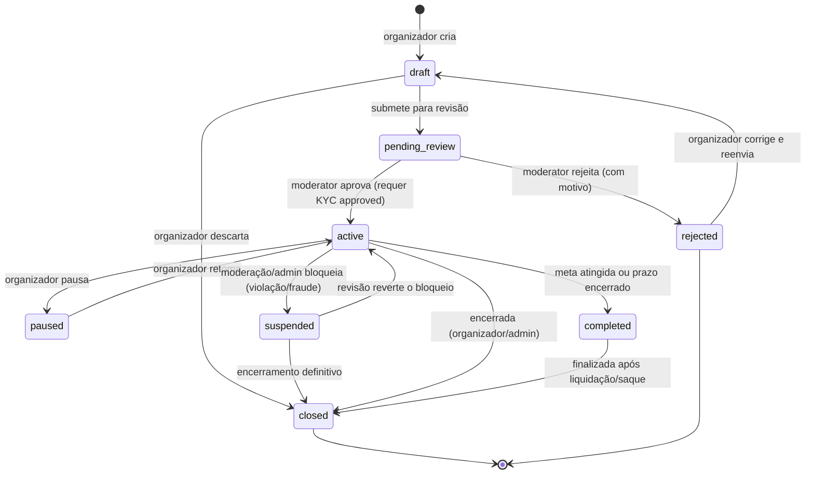
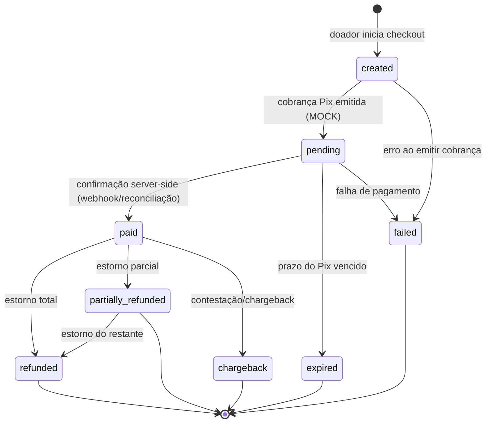
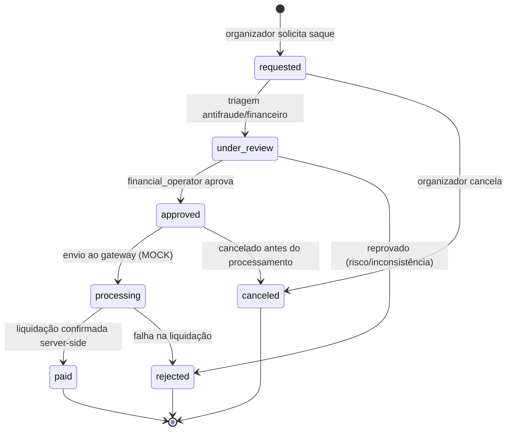

# 03 — Racional de Produto (Product Rationale)

Data: 2026-07-23
Marca: **Apoie Aqui** · Entidade legal: **Soma do Bem** (Joinville/SC)
Escopo: plataforma de crowdfunding de doações (vaquinhas) para causas pessoais e sociais, pagamento por **Pix**.

> Este documento explica **o quê** e **por quê** do produto: problemas resolvidos, quem são os usuários, jornadas e ciclos de vida canônicos, e as regras de negócio de alto nível.
> Detalhes de implementação estão em documentos irmãos:
> - Modelo de domínio e entidades: `docs/05-domain-model.md`
> - Arquitetura de pagamento, ledger e reconciliação: `docs/07-payment-architecture.md`
> - **Decisões pendentes** (taxas, prazos, valores, incentivos): `docs/11-open-decisions.md`
>
> ⚠️ **Nada de dinheiro real no MVP.** Todo pagamento é **MOCK**. O gateway futuro é **Woovi/OpenPix**, mas no MVP não há integração financeira com movimentação real.
> ⚠️ Todo número financeiro citado aqui (taxa de 5%, taxa de gateway ~0,99%, valores de incentivo) é **placeholder versionado** e permanece como **DECISÃO PENDENTE** — a fonte de verdade é `docs/11-open-decisions.md`, não este texto.

---

## 1. Problemas que a plataforma resolve

1. **Arrecadar dinheiro para uma causa é difícil e informal.** Grupos de mensagem, chaves Pix soltas e planilhas manuais não dão transparência ao doador nem prestação de contas ao organizador. O Apoie Aqui oferece uma página pública de campanha, com meta, progresso e histórico verificável.
2. **Falta de confiança do doador.** Quem doa não sabe se a causa é real, se o dinheiro chega ao destino ou se a chave Pix é legítima. A plataforma resolve isso com **moderação prévia**, **KYC do organizador**, página pública sem exposição de dados sensíveis, e um **ledger auditável** que garante que o valor arrecadado corresponde a doações efetivamente confirmadas.
3. **Confirmação de pagamento não confiável.** Em soluções caseiras, o organizador "confia" que o doador pagou. Aqui, **uma doação só é marcada como `paid` por confirmação server-side (webhook/reconciliação)** — nunca pela tela do doador.
4. **Recebimento e saque desorganizados.** O organizador precisa de um fluxo claro para solicitar saque, passar por revisão antifraude e receber o líquido (bruto menos taxa de plataforma e taxa de gateway). O ciclo de saque é rastreável de ponta a ponta.
5. **Ausência de trilha de auditoria.** Cada evento financeiro (doação confirmada, estorno, saque, ajuste de taxa) precisa ser **imutável, idempotente e auditável**. Isso protege organizador, doador, plataforma e atende requisitos regulatórios e de disputa (chargeback).
6. **Categorização e descoberta.** Doadores encontram causas por categoria: **Saúde, Educação, Animais, Meio Ambiente, Esportes, Cultura, Tecnologia, Comunidade, Emergência, Outros.**

---

## 2. Tipos de usuário (7 perfis)

Os papéis são cumulativos em contexto, mas modelados como perfis distintos de autorização. Permissões detalhadas e a matriz completa ficam em `docs/05-domain-model.md`; abaixo, o resumo.

| Perfil | Papel | Permissões-resumo |
|---|---|---|
| **visitor** | Visitante não autenticado | Navegar homepage, listar/buscar campanhas, ver página pública de campanha, iniciar checkout como doador anônimo. Sem acesso a dados privados. |
| **donor** | Doador (autenticado ou convidado) | Tudo do visitor + realizar doação, acompanhar suas contribuições, receber recibo/comprovante, solicitar estorno conforme política. |
| **organizer** | Organizador de campanha | Criar/editar campanha (em `draft`), submeter para revisão, gerenciar a própria campanha publicada, ver dashboard financeiro **da própria campanha**, solicitar saque. Requer **KYC `approved`** para publicar/sacar. |
| **moderator** | Moderador de conteúdo | Revisar campanhas em `pending_review`, aprovar/rejeitar, pausar/suspender por violação, revisar denúncias. Não movimenta dinheiro. |
| **admin** | Administrador da plataforma | Superconjunto operacional: gerenciar usuários e papéis, configurar categorias, ativar/desativar **feature flags**, editar configuração versionada de taxas/incentivos, encerrar campanhas. |
| **financial_operator** | Operador financeiro | Revisar/aprovar saques (`under_review` → `approved`), acompanhar processamento, executar/registrar reconciliação, tratar estornos e chargebacks no ledger. Não altera conteúdo editorial. |
| **support** | Suporte ao usuário | Atendimento: consultar status de doação/saque/campanha, abrir tickets, acionar moderação/financeiro. Acesso de **leitura** a dados operacionais; **sem** acesso a CPF/dados bancários em claro. |

Princípio transversal: **CPF e dados bancários nunca são expostos publicamente** nem a perfis sem necessidade operacional (need-to-know). Ver seção 9 (Privacidade).

---

## 3. Jornadas principais

### 3.1 Visitante → Doador
1. `visitor` chega pela homepage, busca ou link compartilhado.
2. Abre a página pública da campanha (`active`): vê história, meta, progresso (cache de "arrecadado"), categoria e organizador (sem dados sensíveis).
3. Clica em "Quero contribuir" → checkout.
4. Informa valor (em centavos) e dados mínimos; pode doar como convidado ou autenticar.
5. Sistema cria a doação em `created` e gera cobrança Pix **(MOCK no MVP)**.
6. Doador paga; **a confirmação vem por webhook/reconciliação server-side** → doação vai para `paid`.
7. Doador recebe comprovante; o **ledger** registra o crédito e o cache de "arrecadado" da campanha é atualizado.

### 3.2 Cadastro → Organizador → Criar → Moderar → Publicar → Receber → Sacar
1. **Cadastro:** usuário cria conta e passa a poder atuar como `organizer`.
2. **KYC:** organizador inicia verificação (`not_started` → `pending`). Publicação e saque exigem `approved`.
3. **Criar vaquinha:** campanha nasce em `draft`; organizador preenche título, história, categoria, meta e mídia.
4. **Submeter:** `draft` → `pending_review`.
5. **Moderação:** `moderator` avalia. Aprova (`active`) ou rejeita (`rejected`) com motivo.
6. **Publicação:** em `active`, a campanha aparece publicamente e passa a receber doações.
7. **Receber:** doações confirmadas creditam o ledger da campanha.
8. **Sacar:** organizador solicita saque (`requested`); passa por `under_review` (antifraude/financeiro) → `approved` → `processing` → `paid`. O valor líquido = bruto − taxa de plataforma − taxa de gateway.

---

## 4. Ciclo de vida da vaquinha (Campaign)

Status canônicos: `draft`, `pending_review`, `active`, `paused`, `rejected`, `completed`, `closed`, `suspended`.

Notas:
- `paused` interrompe temporariamente o recebimento de doações (ação reversível do organizador).
- `suspended` é bloqueio administrativo por moderação/fraude (ver seções 6 e 7).
- `completed` indica objetivo cumprido (meta ou prazo); ainda pode haver saque pendente antes de `closed`.
- `closed` é terminal (encerramento definitivo). Prazos e regra de "meta atingida" são **DECISÃO PENDENTE** (`docs/11-open-decisions.md`).

---

## 5. Ciclo de vida da contribuição (Donation)

Status canônicos: `created`, `pending`, `paid`, `expired`, `failed`, `refunded`, `partially_refunded`, `chargeback`.

Notas críticas:
- **Nenhuma confirmação vinda do frontend marca a doação como `paid`.** A transição `pending → paid` só ocorre por evento server-side confirmado (webhook do gateway e/ou reconciliação). No MVP isso é simulado (MOCK), mas com a **mesma disciplina de estados**.
- Todo lançamento no ledger é **idempotente**: reprocessar o mesmo webhook não duplica crédito.
- `refunded`/`partially_refunded`/`chargeback` geram lançamentos de débito compensatórios no ledger e reajustam o cache de "arrecadado".

---

## 6. Ciclo de vida do saque (Withdrawal)

Status canônicos: `requested`, `under_review`, `approved`, `processing`, `paid`, `rejected`, `canceled`.

Notas:
- O saque exige **KYC `approved`** e saldo disponível **conforme o ledger** (nunca conforme o cache de "arrecadado").
- O valor líquido é calculado no servidor: bruto − taxa de plataforma (padrão 5% / 500 bps, **placeholder versionado**) − taxa de gateway (~0,99% / 99 bps, **placeholder versionado**). Percentuais e a regra de "primeiro saque sem taxa" são **DECISÃO PENDENTE** (`docs/11-open-decisions.md`).
- Cada transição relevante gera evento auditável no ledger (reserva, débito, liquidação).

---

## 7. Moderação

- Toda campanha passa por **revisão prévia** (`pending_review`) antes de ficar `active`. Aprovação/rejeição é feita por `moderator`, com **motivo obrigatório** na rejeição.
- Moderação contínua: campanhas ativas podem ser **denunciadas** por usuários; `moderator`/`admin` podem `paused` (temporário) ou `suspended` (bloqueio por violação/fraude).
- Critérios de conteúdo (a consolidar em política editorial): veracidade da causa, ausência de conteúdo ilícito/enganoso, adequação da categoria, qualidade mínima de descrição e mídia.
- Ações de moderação são registradas (autor, motivo, timestamp) para auditoria.

---

## 8. Prevenção de fraude

- **KYC do organizador** obrigatório para publicar e sacar (`not_started → pending → approved`; `rejected`/`expired` bloqueiam).
- **Confirmação de pagamento apenas server-side** — elimina falsificação de "pagamento" pelo cliente.
- **Triagem de saque** (`under_review`) por `financial_operator` antes de liberar dinheiro.
- **Idempotência e imutabilidade** do ledger evitam duplicidade e adulteração de saldo.
- Sinais de risco (a detalhar): velocidade anômala de doações, valores atípicos, incompatibilidade entre titular do KYC e conta de recebimento, histórico de chargebacks.
- **Suspensão administrativa** (`suspended`) como resposta rápida a fraude confirmada ou suspeita forte.

---

## 9. Privacidade

- **CPF e dados bancários nunca são expostos publicamente** e não trafegam para perfis sem necessidade operacional. `support` tem leitura operacional, mas **não** vê esses dados em claro.
- Página pública de campanha exibe apenas dados não sensíveis (história, meta, progresso, categoria, nome/alias do organizador).
- Doações podem ser **anônimas** publicamente; a identidade fica restrita aos registros internos e ao recibo do próprio doador.
- Tratamento de dados pessoais segue a LGPD (base legal, minimização, retenção). Detalhes de armazenamento/criptografia em `docs/05-domain-model.md` e `docs/07-payment-architecture.md`.

---

## 10. Auditoria

- **Todo evento financeiro é auditável, imutável e idempotente.** O **ledger financeiro é a fonte oficial** do saldo; o campo "arrecadado" da campanha é **apenas cache** derivado dele.
- Dinheiro é sempre representado em **centavos (inteiros)** — nunca em ponto flutuante.
- Cada lançamento carrega: origem (doação/saque/estorno/ajuste), valor em centavos, referência idempotente, timestamp e ator.
- Alterações de configuração (taxas, feature flags, incentivos) são **versionadas** e registram quem alterou e quando.
- Ações administrativas e de moderação também compõem a trilha de auditoria.

---

## 11. Conciliação financeira (reconciliation)

- A verdade financeira é reconstruída pelo **ledger**, confrontado periodicamente com os eventos do gateway (Woovi/OpenPix no futuro; MOCK no MVP).
- Divergências (doação marcada paga sem contrapartida, webhook perdido/duplicado, estorno não refletido) geram itens de conciliação tratados por `financial_operator`.
- O cache "arrecadado" é **recalculável** a partir do ledger a qualquer momento; em caso de divergência, **o ledger prevalece**.
- Fluxos detalhados de reconciliação, webhooks e idempotência: `docs/07-payment-architecture.md`.

---

## 12. Notificações

Eventos que devem gerar notificação (canais e templates a definir):
- **Doador:** doação confirmada (`paid`), estorno (`refunded`/`partially_refunded`), falha/expiração da cobrança.
- **Organizador:** campanha aprovada (`active`) / rejeitada (`rejected`) com motivo, pausa/suspensão, doação recebida, marco de meta, atualizações de saque (`approved`/`processing`/`paid`/`rejected`).
- **Moderação/Financeiro:** nova campanha em `pending_review`, novo saque em `under_review`, denúncias, itens de conciliação em aberto.
- Regras de frequência, canais (e-mail/push/in-app) e opt-out são **DECISÃO PENDENTE** (`docs/11-open-decisions.md`).

---

## 13. Critérios para publicação (`pending_review` → `active`)

- Organizador com **KYC `approved`**.
- Campos obrigatórios completos: título, história/descrição, **categoria** válida, meta (em centavos), mídia mínima.
- Conteúdo aprovado pela moderação (sem violação de política editorial).
- Ausência de sinais de fraude bloqueantes.

## 14. Critérios para bloqueio/encerramento

- **`paused`** (reversível): a pedido do organizador ou medida cautelar leve.
- **`suspended`** (administrativo): violação de política, denúncia procedente, suspeita/confirmação de fraude, problema de KYC.
- **`rejected`**: reprovação na revisão prévia, sempre com motivo.
- **`completed`**: meta atingida ou prazo encerrado (regra exata **PENDENTE**).
- **`closed`** (terminal): encerramento definitivo pelo organizador/admin, após liquidação/saque quando aplicável.

---

## 15. Regras configuráveis: taxas e incentivos

Todas as regras econômicas vivem em **configuração versionada** + **feature flags**, nunca hardcoded em regra de negócio dispersa. Valores abaixo são **placeholders** — a fonte de verdade é `docs/11-open-decisions.md`.

**Taxas (versionadas, pendentes de decisão de negócio):**
- Taxa da plataforma: padrão **5% (500 bps)**.
- Taxa de gateway: placeholder **~0,99% (99 bps)**.
- Toda taxa é aplicada **no servidor**, sobre valores em centavos, com a versão da configuração registrada no lançamento do ledger (rastreabilidade histórica).

**Incentivos/monetização observados no legado — FORA DO ESCOPO atual (documentados como possibilidade futura, cada um atrás de feature flag):**
- Corações pagos (R$ 0,99).
- Emojis pagos (R$ 0,99).
- Destaque pago de campanha (R$ 4,99).
- "Primeira contribuição da plataforma de R$ 10" ao criar a vaquinha.
- "Primeiro saque sem taxa".
- "Criar grátis".

Nenhum desses incentivos está implementado no MVP. Cada um, se ativado, será controlado por **feature flag** e por **configuração versionada**, e sua decisão de ativação/valor está em `docs/11-open-decisions.md`.

---

### Referências
- `docs/05-domain-model.md` — entidades, status, matriz de permissões, dados sensíveis.
- `docs/07-payment-architecture.md` — ledger, webhooks, idempotência, reconciliação, Woovi/OpenPix.
- `docs/11-open-decisions.md` — taxas, prazos, valores de incentivo, notificações e demais decisões pendentes.
