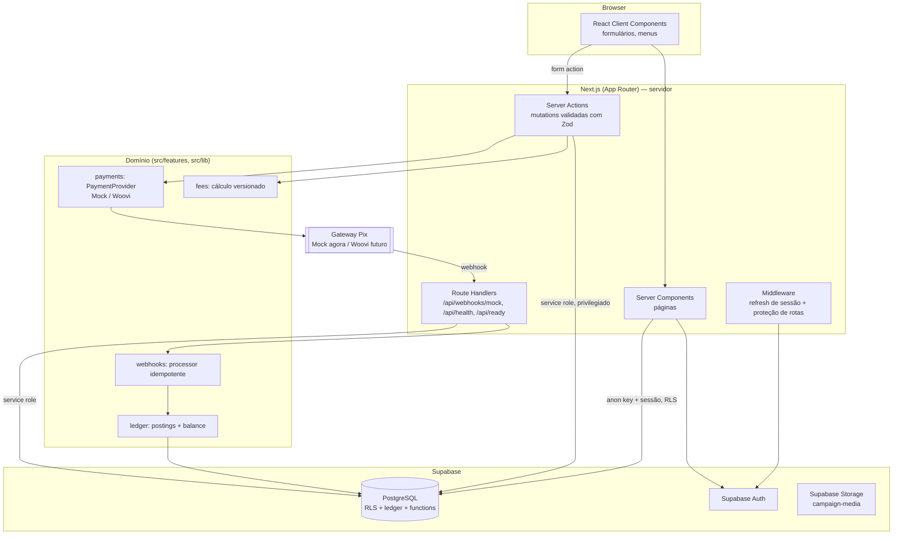
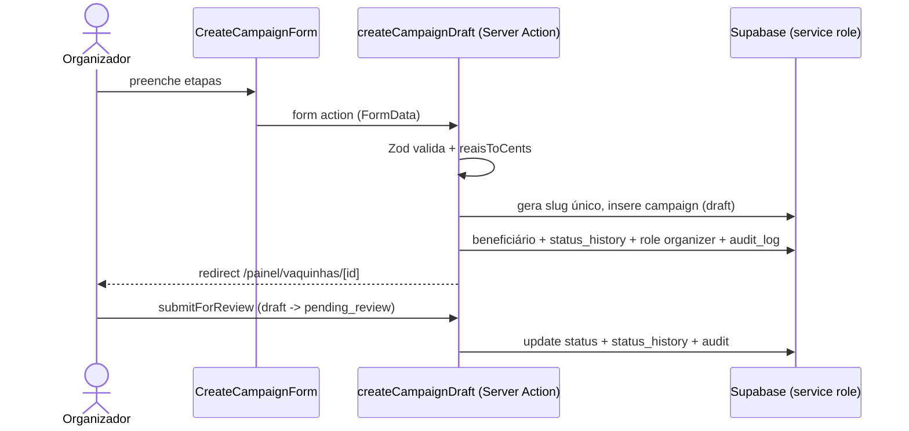
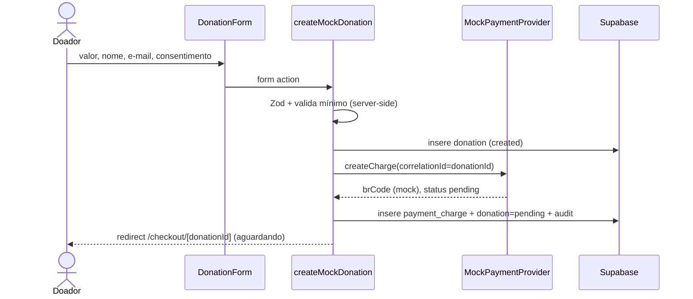
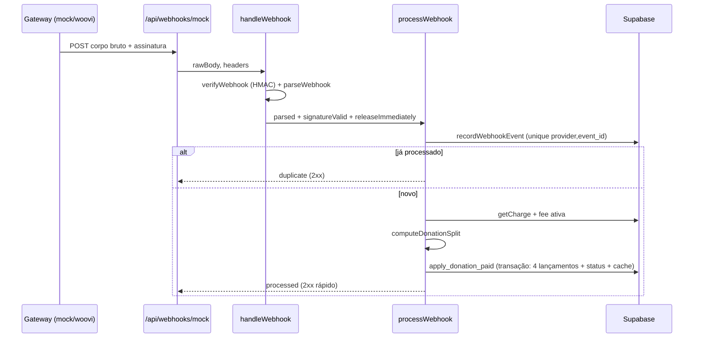
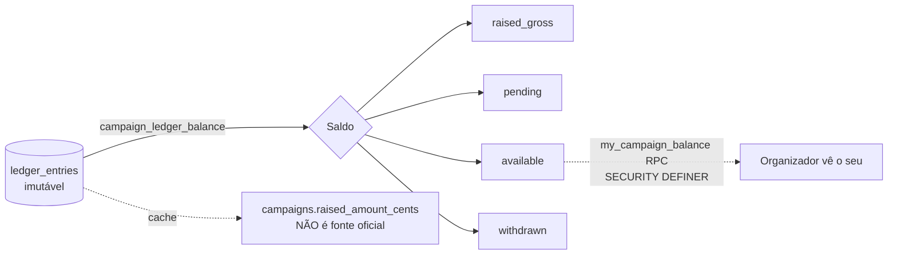
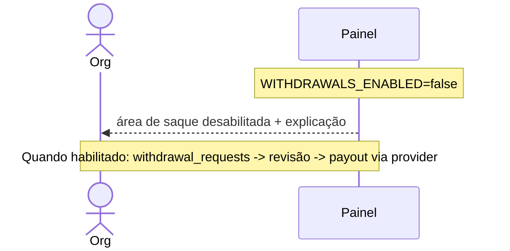

# 04 — Arquitetura

## Visão geral

Apoie Aqui é um **monólito modular** em **Next.js (App Router)** + **Supabase** (PostgreSQL, Auth, Storage). Uma única aplicação, sem microsserviços e sem filas externas nesta fase. A separação é feita por **camadas** e por **módulos de feature**, não por serviços.

Princípios:
- **Tudo que é sensível roda no servidor** (Server Components, Server Actions, Route Handlers).
- **RLS no banco** como segunda barreira de autorização.
- **Regras financeiras 100% server-side**, idempotentes, auditáveis; ledger imutável como fonte oficial.
- **Dinheiro em centavos** (inteiros) de ponta a ponta.
- **Segredos só no servidor**; a service role nunca chega ao browser.



## Camadas (separação obrigatória)

O escopo exige separar interface, validação, caso de uso, acesso a dados e integração externa. Mapeamento no código:

| Camada | Onde | Exemplo |
|---|---|---|
| **Interface** | `src/app/**` (páginas), `src/components/**`, `*Form.tsx` client | `CampaignCard`, `DonationForm` |
| **Validação** | Zod nos Server Actions/Route Handlers | `schema.safeParse` em `donations/actions.ts` |
| **Caso de uso** | `src/features/*/actions.ts` e `src/features/*/*.ts` (lógica pura) | `createMockDonation`, `processWebhook` |
| **Acesso a dados** | `src/features/*/queries.ts`, `src/server/*`, clientes Supabase | `SupabaseWebhookRepository`, `queries.ts` |
| **Integração externa** | `src/features/payments/*` (PaymentProvider) | `MockPaymentProvider`, `WooviPaymentProvider` |

**Regra:** nenhuma regra de negócio dentro de componentes React. Componentes só renderizam e disparam actions.

## Estrutura de pastas (real)

```
src/
  app/
    (site)/            # área pública + auth + painel (Header/Footer)
      page.tsx         # home
      causes/          # listagem + [slug]
      checkout/        # form + [donationId] status
      login/ register/ forgot-password/
      criar-vaquinha/ onboarding/ painel/ denunciar/
      como-funciona/ sobre/ taxas-e-prazos/ termos-de-uso/ ...
    admin/             # painel administrativo (layout próprio, requireStaff)
    api/               # webhooks/mock, health, ready
    layout.tsx globals.css error.tsx not-found.tsx
  components/          # UI reutilizável (Header, Footer, CampaignCard, ...)
  features/
    auth/ profiles/ onboarding/ campaigns/ donations/
    payments/ ledger/ webhooks/ moderation/ reports/
  lib/                # money, br, logger, rate-limit, feature-flags, supabase/*
  server/             # implementações server-only (webhook repo/handler)
  types/              # tipos gerados/compartilhados
  middleware.ts
supabase/migrations/  # schema + RLS + functions + seed de config
scripts/              # db-migrate, seed, smoke-e2e
docs/
```

## Fluxos principais (Mermaid)

### Criação da vaquinha


### Contribuição (mock)


### Processamento do webhook


### Cálculo de saldo


### Solicitação de saque (preparado, desativado)


## Decisões arquiteturais (ADR resumido)

- **Monólito modular (não microsserviços):** simplicidade operacional, menor superfície de ataque, transações locais. Escopo exige.
- **Supabase:** Postgres gerenciado + Auth + Storage + RLS num só lugar → segurança concentrada e menos código de infra.
- **Server Actions para mutations:** proteção CSRF nativa do Next, validação server-side, nada de valores confiados ao cliente.
- **Service role só no servidor** para escritas privilegiadas (webhook, moderação, doações), com RLS protegendo o acesso via anon.
- **Ledger imutável + idempotência** por índice único, não por lock aplicacional → correto sob concorrência.
- **PaymentProvider como porta/adaptador:** troca de gateway (Asaas→Woovi) sem tocar no domínio; Mock permite testar tudo sem dinheiro real.

Ver também: `docs/05-domain-model.md`, `docs/06-security-and-privacy.md`, `docs/07-payment-architecture.md`.
