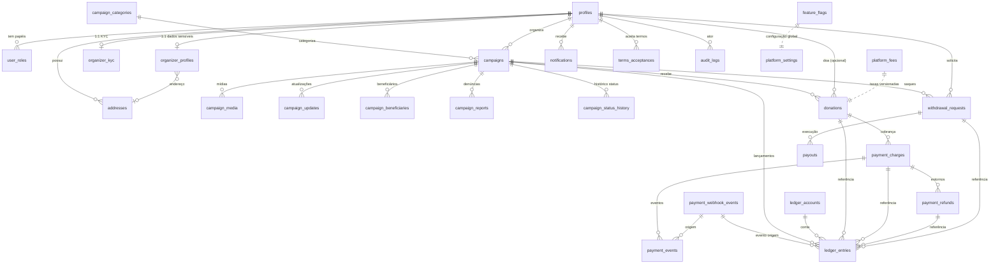

# 05 — Modelo de Domínio (Domain Model)

> Fonte da verdade deste documento: os arquivos SQL em `supabase/migrations/`
> (`0001_schema.sql`, `0002_financial.sql`, `0003_platform.sql`, `0004_rls.sql`,
> `0005_seed_config.sql`, `0006_public_views.sql`, `0007_apply_donation.sql`).
> Toda coluna descrita aqui existe literalmente nessas migrações. Quando houver
> divergência entre este texto e o SQL, **o SQL vence**.

Documentos relacionados:
- [`04-architecture.md`](./04-architecture.md) — arquitetura de aplicação, camadas e fluxo de dados.
- [`06-security-and-privacy.md`](./06-security-and-privacy.md) — detalhamento de RLS, papéis e proteção de dados pessoais.
- [`07-payment-architecture.md`](./07-payment-architecture.md) — provedores de pagamento, webhooks, idempotência e conciliação.

---

## 1. Visão geral do modelo

Princípios que atravessam todo o esquema:

- **Dinheiro sempre em centavos (`bigint`).** Nenhum valor monetário é `numeric`/`float`.
  Toda coluna de valor termina em `_cents` e é inteiro em centavos de BRL. A moeda é
  registrada em colunas `currency char(3)` com default `'BRL'`.
- **Identificadores UUID.** Todas as entidades usam `uuid` como PK, gerado por
  `gen_random_uuid()` (extensão `pgcrypto`), exceto tabelas cujo PK é herdado de
  `auth.users` (`profiles.id`), chaves compostas (`user_roles`) ou catálogos com PK
  textual (`feature_flags.key`, `platform_settings.key`, `ledger_accounts.account`).
- **Timestamps.** Praticamente toda tabela tem `created_at timestamptz not null default now()`.
  Tabelas mutáveis também têm `updated_at`, mantido automaticamente pelo trigger
  `set_updated_at()` (função que faz `new.updated_at = now()`), instalado como
  `trg_<tabela>_updated`.
- **Soft delete só onde faz sentido.** Apenas `campaigns` e `profiles` têm coluna
  `deleted_at timestamptz`. Registros financeiros, ledger e webhooks **nunca** são
  apagados logicamente — são imutáveis ou corrigidos por compensação. As demais
  tabelas removem por `on delete cascade`/`restrict` conforme a integridade exige.
- **Histórico de status.** Mudanças de status de campanha são auditadas em
  `campaign_status_history` (de/para, autor, motivo). O ledger é ele próprio um
  histórico imutável de eventos financeiros.
- **Slug único.** `campaigns.slug` e `campaign_categories.slug` são `text not null unique`.
  A normalização é feita por `slugify()` (kebab-case sem acento, via `unaccent_fallback()`);
  a unicidade final é garantida na aplicação com sufixo hexadecimal.
- **Ledger é a fonte oficial de saldo.** `campaigns.raised_amount_cents` e
  `campaigns.donors_count` são **apenas cache** derivado de `ledger_entries` para leitura
  rápida (listagens públicas). Nenhuma decisão financeira deve usar o cache — usar
  sempre `campaign_ledger_balance()` / `my_campaign_balance()`.

Extensões habilitadas: `pgcrypto` (UUIDs) e `citext` (e-mails case-insensitive).

---

## 2. Diagrama de entidades (ER)



> Notas de leitura do diagrama: relações tracejadas (`..`) indicam associação
> conceitual/configuracional (não FK direta). `platform_fees` fornece os parâmetros
> aplicados às doações, mas a doação não carrega FK para a versão de taxa.

---

## 3. Tabelas

### Núcleo de identidade

#### `profiles`
- **Propósito:** perfil da aplicação, 1:1 com `auth.users` (Supabase Auth).
- **Colunas principais:** `id uuid PK → auth.users(id) on delete cascade`, `full_name`,
  `display_name`, `avatar_url`, `email citext`, `phone_e164` (**privado**),
  `onboarding_status kyc_status` (default `not_started`), `is_suspended boolean`,
  `suspended_reason`, `created_at`, `updated_at`, **`deleted_at`** (soft delete).
- **Constraints/índices:** PK em `id`. Trigger `trg_profiles_updated`.
- **Observação:** criado automaticamente pela trigger `handle_new_user()` no cadastro.

#### `user_roles`
- **Propósito:** N papéis por usuário (RBAC).
- **Colunas:** `user_id → profiles(id) cascade`, `role app_role`, `granted_by → profiles(id)`,
  `created_at`.
- **Chave:** PK composta `(user_id, role)`.

#### `addresses`
- **Propósito:** endereços do usuário (**privado**).
- **Colunas:** `id`, `user_id → profiles(id) cascade`, `postal_code` (CEP), `street`,
  `number`, `complement`, `district`, `city`, `state_uf char(2)`, `country char(2)` default `'BR'`.
- **Índices:** `idx_addresses_user(user_id)`. Trigger `trg_addresses_updated`.

#### `organizer_profiles`
- **Propósito:** dados sensíveis do organizador (recebedor). **Privado.**
- **Colunas:** `user_id PK → profiles(id) cascade`, `legal_name`, **`cpf_digits char(11)`
  (privado — só dígitos, NUNCA em payload público)**, `birth_date`, `phone_e164`,
  `address_id → addresses(id)`, `beneficiary_declaration beneficiary_kind` (default `self`),
  `onboarding_completed_at`.
- **Índices:** trigger `trg_organizer_updated`.

#### `organizer_kyc`
- **Propósito:** status/preparação de KYC do recebedor (sem dados bancários nesta fase).
- **Colunas:** `user_id PK → profiles(id) cascade`, `status kyc_status` (default `not_started`),
  `provider payment_provider`, `external_kyc_id`, `reviewed_by → profiles(id)`,
  `reviewed_at`, `rejection_reason`.
- **Índices:** trigger `trg_kyc_updated`.

### Campanhas

#### `campaign_categories`
- **Propósito:** catálogo de categorias.
- **Colunas:** `id`, **`slug text not null unique`**, `name`, `sort_order int`,
  `is_active boolean` default `true`.
- **Seed:** 10 categorias (saúde, educação, animais, meio-ambiente, esportes, cultura,
  tecnologia, comunidade, emergência, outros — ver `0005`).

#### `campaigns`
- **Propósito:** a vaquinha em si.
- **Colunas:** `id`, **`slug text not null unique`**, `organizer_id → profiles(id) on delete restrict`,
  `category_id → campaign_categories(id)`, `title`, `story`, `cover_image_path` (Storage),
  `goal_amount_cents bigint check >= 0`, `city`, `state_uf char(2)`,
  `status campaign_status` (default `draft`),
  **`raised_amount_cents bigint` (CACHE não-oficial)**, **`donors_count int` (CACHE)**,
  `published_at`, `reviewed_by`, `reviewed_at`, `rejection_reason`, `ends_at`,
  `created_at`, `updated_at`, **`deleted_at`** (soft delete).
- **Índices:** `idx_campaigns_status`, `idx_campaigns_organizer`, `idx_campaigns_category`,
  `idx_campaigns_state`, `idx_campaigns_published(published_at desc)`. Trigger `trg_campaigns_updated`.

#### `campaign_media`
- **Propósito:** imagens/vídeos adicionais.
- **Colunas:** `id`, `campaign_id → campaigns(id) cascade`, `storage_path`, `kind` (default `image`),
  `sort_order`.
- **Índices:** `idx_media_campaign`.

#### `campaign_updates`
- **Propósito:** atualizações da história postadas pelo organizador.
- **Colunas:** `id`, `campaign_id → campaigns(id) cascade`, `author_id → profiles(id)`,
  `title`, `body text not null`, `created_at`, `updated_at`.
- **Índices:** `idx_updates_campaign`. Trigger `trg_updates_updated`.

#### `campaign_beneficiaries`
- **Propósito:** beneficiários da vaquinha (quando terceiro).
- **Colunas:** `id`, `campaign_id → campaigns(id) cascade`, `kind beneficiary_kind` (default `self`),
  `full_name`, `relationship` (vínculo), **`cpf_digits char(11)` (privado)**.
- **Índices:** `idx_beneficiaries_campaign`.
- **Privacidade:** contém CPF; **não** é de leitura pública (RLS restringe a dono/staff).

#### `campaign_reports`
- **Propósito:** denúncias de campanha.
- **Colunas:** `id`, `campaign_id → campaigns(id) cascade`, `reporter_id → profiles(id)`,
  `reporter_email citext`, `reason text not null`, `details`, `status report_status` (default `open`),
  `handled_by`, `handled_at`.
- **Índices:** `idx_reports_campaign`, `idx_reports_status`.

#### `campaign_status_history`
- **Propósito:** auditoria de mudanças de status (histórico).
- **Colunas:** `id`, `campaign_id → campaigns(id) cascade`, `from_status campaign_status`,
  `to_status campaign_status not null`, `changed_by → profiles(id)`, `reason`.
- **Índices:** `idx_status_hist_campaign`.

### Doações e pagamentos

#### `donations`
- **Propósito:** intenção de contribuição (visitante ou logado). **Nunca marcada como paga pelo frontend.**
- **Colunas:** `id`, `campaign_id → campaigns(id) on delete restrict`, `donor_id → profiles(id)`
  (null = visitante anônimo), `donor_name`, `donor_email citext`, `is_anonymous boolean`,
  `message`, `amount_cents bigint check > 0`, `currency char(3)` default `'BRL'`,
  `status donation_status` (default `created`), `provider payment_provider` (default `mock`),
  `consent_terms boolean`, `terms_version`, `created_at`, `updated_at`, `paid_at`.
- **Índices:** `idx_donations_campaign`, `idx_donations_status`, `idx_donations_donor`.
  Trigger `trg_donations_updated`.

#### `payment_charges`
- **Propósito:** cobrança no provedor (mock/woovi), 1:1 lógico com `donation`.
- **Colunas:** `id`, `donation_id → donations(id) restrict`, `provider payment_provider`,
  **`correlation_id text` (idempotência na criação)**, `external_charge_id` (id no gateway),
  `status donation_status` (default `created`), `amount_cents bigint check > 0`,
  `brcode` (Pix copia-e-cola), `qr_code_image_url`, `expires_at`.
- **Constraints/índices únicos:** **`uq_charges_correlation (provider, correlation_id)`**,
  **`uq_charges_external (provider, external_charge_id)` where not null**, `idx_charges_donation`.
  Trigger `trg_charges_updated`.

#### `payment_webhook_events`
- **Propósito:** recepção **bruta** de webhooks (idempotência forte na borda).
- **Colunas:** `id`, `provider`, `event_id` (id único do evento no provedor), `event_type`,
  `signature_valid boolean`, **`raw_payload jsonb` (protegido por RLS — só service role)**,
  `received_at`, `processed_at`, `processing_error`.
- **Constraints/índices únicos:** **`uq_webhook_event (provider, event_id)`** — impede processar
  o mesmo evento duas vezes; `idx_webhook_unprocessed(processed_at) where processed_at is null`.

#### `payment_events`
- **Propósito:** eventos normalizados derivados dos webhooks (auditoria).
- **Colunas:** `id`, `charge_id → payment_charges(id) on delete set null`,
  `webhook_event_id → payment_webhook_events(id) on delete set null`, `provider`,
  `type` (ex.: `charge_completed`), `amount_cents`, `occurred_at`, `created_at`.
- **Índices:** `idx_payment_events_charge`.

#### `payment_refunds`
- **Propósito:** estornos.
- **Colunas:** `id`, `charge_id → payment_charges(id) restrict`, `provider`,
  `correlation_id`, `external_refund_id`, `amount_cents bigint check > 0`, `reason`,
  `status text` (default `requested`).
- **Constraints/índices únicos:** **`uq_refunds_correlation (provider, correlation_id)`**,
  `idx_refunds_charge`. Trigger `trg_refunds_updated`.

### Ledger e saques

#### `ledger_entries`
- **Propósito:** **livro-razão imutável — fonte oficial de saldo.** Cada evento financeiro
  cria um grupo de lançamentos (`group_id`). `amount_cents` é sempre positivo; a direção é
  dada por `direction`/`entry_type`/`account`.
- **Colunas:** `id`, `group_id uuid not null` (agrupa lançamentos do mesmo evento),
  `campaign_id → campaigns(id) restrict`, `account ledger_account`, `entry_type ledger_entry_type`,
  **`direction smallint check in (-1, 1)`** (+1 credita, -1 debita), `amount_cents bigint check >= 0`,
  `currency char(3)` default `'BRL'`, `donation_id`, `charge_id`, `refund_id`,
  `withdrawal_id` (FK `fk_ledger_withdrawal → withdrawal_requests`, adicionada após criar a tabela),
  `webhook_event_id`, **`idempotency_key text not null`**, `memo`, `created_by → profiles(id)`
  (null = sistema/webhook), `created_at`.
- **Constraints/índices únicos:** **`uq_ledger_idempotency (idempotency_key)`** — impede lançar
  duas vezes o mesmo componente do mesmo evento; `idx_ledger_campaign`, `idx_ledger_group`,
  `idx_ledger_account`, `idx_ledger_donation`.
- **Imutabilidade:** triggers `trg_ledger_no_update` e `trg_ledger_no_delete` chamam
  `ledger_block_mutation()`, que sempre lança exceção. Correções são feitas por **lançamentos
  compensatórios**, nunca por UPDATE/DELETE.

#### `ledger_accounts`
- **Propósito:** catálogo/descrição das contas contábeis (referência). **O saldo vem da soma de
  `ledger_entries`, não daqui.**
- **Colunas:** `account ledger_account PK`, `description text not null`, `is_campaign_scoped boolean`.
- **Seed:** as 7 contas do enum `ledger_account` (ver seção 5).

#### `withdrawal_requests`
- **Propósito:** solicitação de saque (desativada por feature flag `WITHDRAWALS_ENABLED` nesta fase).
- **Colunas:** `id`, `campaign_id → campaigns(id) restrict`, `organizer_id → profiles(id) restrict`,
  `amount_cents bigint check > 0`, `fee_cents`, `net_cents`, `status withdrawal_status` (default `requested`),
  **`bank_payload jsonb` (privado — dados bancários NUNCA expostos publicamente)**,
  `reviewed_by`, `reviewed_at`, `rejection_reason`.
- **Índices:** `idx_withdrawals_campaign`, `idx_withdrawals_status`. Trigger `trg_withdrawals_updated`.

#### `payouts`
- **Propósito:** execução do pagamento do saque no provedor (futuro).
- **Colunas:** `id`, `withdrawal_id → withdrawal_requests(id) restrict`, `provider`,
  `correlation_id`, `external_payout_id`, `amount_cents bigint check > 0`, `status text` (default `created`).
- **Constraints/índices únicos:** **`uq_payouts_correlation (provider, correlation_id)`**.
  Trigger `trg_payouts_updated`.

### Configuração de taxas

#### `platform_fees`
- **Propósito:** configuração de taxas **versionada** (não hardcoded). Uma versão ativa por vez;
  correções criam nova versão.
- **Colunas:** `id`, `version int not null unique`, `platform_fee_bps int` (default `500` = 5,00%),
  `gateway_fee_bps int` (default `99`), `gateway_fee_fixed_cents bigint`, `min_contribution_cents`,
  `min_withdrawal_cents`, `withdrawal_fee_cents`, `chargeback_reserve_bps`, `release_delay_days`
  (carência p/ liberar saldo), `is_active boolean` (default `false`), `notes`.
- **Constraints/índices únicos:** `version` único; **`uq_platform_fees_active (is_active) where is_active`**
  — garante no máximo uma versão ativa.
- **Seed:** versão `1` ativa com placeholders (5,00% plataforma, 0,99% gateway; mínimos de
  contribuição/saque). Valores financeiros são pendentes de decisão de negócio.

### Plataforma / suporte

#### `notifications`
- **Propósito:** notificações in-app por usuário.
- **Colunas:** `id`, `user_id → profiles(id) cascade`, `type`, `title`, `body`, `data jsonb`,
  `read_at`, `created_at`.
- **Índices:** `idx_notifications_user(user_id, read_at)`.

#### `terms_acceptances`
- **Propósito:** aceite de termos **versionado**.
- **Colunas:** `id`, `user_id → profiles(id) on delete set null`, `email citext`,
  `terms_version text not null`, `document_kind` (default `terms_of_use`), `accepted_at`,
  **`ip_hash` (hash do IP — sem armazenar IP cru)**, `user_agent`.
- **Índices:** `idx_terms_user`.

#### `audit_logs`
- **Propósito:** trilha de auditoria de ações sensíveis/admin.
- **Colunas:** `id`, `actor_id → profiles(id)`, `action` (ex.: `campaign.approve`),
  `entity_type`, `entity_id`, `metadata jsonb`, `correlation_id`, `created_at`.
- **Índices:** `idx_audit_actor`, `idx_audit_entity(entity_type, entity_id)`, `idx_audit_created(created_at desc)`.

#### `feature_flags`
- **Propósito:** flags globais (fonte da verdade no banco).
- **Colunas:** `key text PK`, `enabled boolean` (default `false`), `description`, `updated_at`.
- **Seed:** `PAYMENTS_ENABLED`, `WOOVI_ENABLED`, `WOOVI_SPLIT_ENABLED`, `WOOVI_SUBACCOUNTS_ENABLED`,
  `WITHDRAWALS_ENABLED`, `KYC_ENABLED`, `HEARTS_ENABLED`, `EMOJIS_ENABLED`, `HIGHLIGHT_ENABLED`,
  `PLATFORM_SEED_DONATION_ENABLED` (todas `false` nesta fase). Trigger `trg_flags_updated`.

#### `platform_settings`
- **Propósito:** configurações gerais chave/valor.
- **Colunas:** `key text PK`, `value jsonb not null`, `description`, `updated_at`.
- **Seed:** `brand`, `terms_version`, `privacy_version`, `campaign_max_days`, `auto_publish`.
  Trigger `trg_settings_updated`.

---

## 4. ENUMs (valores exatos)

| ENUM | Valores |
|------|---------|
| `app_role` | `donor`, `organizer`, `moderator`, `admin`, `financial_operator`, `support` |
| `campaign_status` | `draft`, `pending_review`, `active`, `paused`, `rejected`, `completed`, `closed`, `suspended` |
| `donation_status` | `created`, `pending`, `paid`, `expired`, `failed`, `refunded`, `partially_refunded`, `chargeback` |
| `withdrawal_status` | `requested`, `under_review`, `approved`, `processing`, `paid`, `rejected`, `canceled` |
| `kyc_status` | `not_started`, `pending`, `approved`, `rejected`, `expired` |
| `payment_provider` | `mock`, `woovi` |
| `beneficiary_kind` | `self`, `third_party` |
| `report_status` | `open`, `reviewing`, `resolved`, `dismissed` |
| `ledger_entry_type` | `donation_gross`, `gateway_fee`, `platform_fee`, `campaign_credit`, `hold`, `hold_release`, `refund`, `chargeback`, `chargeback_reserve`, `chargeback_reserve_release`, `withdrawal_hold`, `withdrawal_paid`, `adjustment` |
| `ledger_account` | `gateway_clearing`, `gateway_fee_expense`, `platform_revenue`, `campaign_pending`, `campaign_available`, `campaign_withdrawn`, `chargeback_reserve` |

---

## 5. Ledger financeiro

O ledger (`ledger_entries`) é um **livro-razão de partidas** imutável. Ele — e não o cache
`campaigns.raised_amount_cents` — é a fonte oficial de qualquer número financeiro.

### Contas (`ledger_account`)

| Conta | Descrição | Escopo campanha |
|-------|-----------|-----------------|
| `gateway_clearing` | Caixa mantido no gateway (ativo da plataforma) | não |
| `gateway_fee_expense` | Despesa com taxa do gateway | não |
| `platform_revenue` | Receita da plataforma | não |
| `campaign_pending` | Saldo do organizador em carência | sim |
| `campaign_available` | Saldo do organizador disponível para saque | sim |
| `campaign_withdrawn` | Valor já sacado pelo organizador | sim |
| `chargeback_reserve` | Reserva para chargebacks | não |

O catálogo `ledger_accounts` guarda essas descrições e a flag `is_campaign_scoped`, mas o
saldo **nunca** é lido de lá — vem sempre da soma de `ledger_entries`.

### Tipos de lançamento (`ledger_entry_type`)

`donation_gross`, `gateway_fee`, `platform_fee`, `campaign_credit`, `hold`, `hold_release`,
`refund`, `chargeback`, `chargeback_reserve`, `chargeback_reserve_release`, `withdrawal_hold`,
`withdrawal_paid`, `adjustment`. Cada lançamento tem `direction` (+1 credita / -1 debita) e
`amount_cents` sempre positivo — o sinal financeiro é a combinação de `direction`, `entry_type`
e `account`.

### Imutabilidade

`ledger_entries` **não aceita UPDATE nem DELETE**: os triggers `trg_ledger_no_update` e
`trg_ledger_no_delete` invocam `ledger_block_mutation()`, que lança exceção em qualquer tentativa
(`'ledger_entries é imutável: use lançamentos compensatórios'`). Correções são sempre feitas por
lançamentos compensatórios (ex.: `refund`, `chargeback`, `adjustment`).

### Idempotência

Toda linha carrega `idempotency_key text not null`, com índice único
**`uq_ledger_idempotency`**. Isso impede lançar duas vezes o mesmo componente do mesmo evento.
Reprocessar um webhook gera `unique_violation` (SQLSTATE 23505) no segundo insert, desfazendo a
transação inteira — a idempotência do ledger é a última linha de defesa contra duplicação.

### Função oficial de saldo — `campaign_ledger_balance(p_campaign_id uuid)`

`language sql stable`. Agrega `ledger_entries` da campanha e retorna oito colunas em centavos:

- `raised_gross_cents` = soma de `amount_cents` onde `entry_type = 'donation_gross'`;
- `platform_fee_cents` = soma onde `entry_type = 'platform_fee'`;
- `gateway_fee_cents` = soma onde `entry_type = 'gateway_fee'`;
- `net_cents` = soma de `direction * amount_cents` onde `entry_type = 'campaign_credit'`;
- `pending_cents` = soma de `direction * amount_cents` onde `account = 'campaign_pending'`;
- `available_cents` = soma de `direction * amount_cents` onde `account = 'campaign_available'`;
- `withdrawn_cents` = soma de `direction * amount_cents` onde `account = 'campaign_withdrawn'`;
- `refunded_cents` = soma de `amount_cents` onde `entry_type in ('refund','chargeback')`.

### RPC exposta — `my_campaign_balance(p_campaign_id uuid)` (SECURITY DEFINER)

`language plpgsql stable security definer`. É o único caminho pelo qual o cliente lê saldo:
verifica se `auth.uid()` é o organizador da campanha **ou** staff (`auth_is_staff()`); se não,
lança `'not authorized'`. Caso autorizado, retorna `campaign_ledger_balance(p_campaign_id)`.
Permissões: `revoke all ... from public` e `grant execute ... to authenticated`.

### Aplicação transacional — `apply_donation_paid(...)` (SECURITY DEFINER)

Função `security definer` chamada pelo servidor (service role) ao confirmar um pagamento.
Toda a operação roda em **uma transação**. Assinatura:
`apply_donation_paid(p_charge_id, p_webhook_event_id, p_paid_at, p_gross, p_gateway_fee,
p_platform_fee, p_net, p_release_immediately)`.

Passos:
1. Resolve `donation_id` a partir do `charge` (erro se ausente) e `campaign_id` a partir da doação.
2. Decide a conta de crédito: `campaign_available` se `p_release_immediately`, senão `campaign_pending`.
3. Insere **4 lançamentos** no ledger (mesmo `group_id = p_charge_id`), com `idempotency_key`
   prefixado por `<donation_id>:donation_paid:` + sufixo (`donation_gross`, `gateway_fee`,
   `platform_fee`, `campaign_credit`):
   - `gateway_clearing` / `donation_gross` = `p_gross`;
   - `gateway_fee_expense` / `gateway_fee` = `p_gateway_fee`;
   - `platform_revenue` / `platform_fee` = `p_platform_fee`;
   - conta de crédito escolhida / `campaign_credit` = `p_net`.
4. Marca `payment_charges.status = 'paid'` e `donations.status = 'paid'` (com `paid_at`).
5. Atualiza o **cache** da campanha (`raised_amount_cents` = soma de `donation_gross`;
   `donors_count` = contagem distinta de doações com `campaign_credit`).

Se o evento já foi aplicado, o segundo insert colide no `uq_ledger_idempotency` (23505) e a
transação inteira é revertida — nada é duplicado. Permissões: `revoke all ... from public, anon,
authenticated` (só service role executa). Detalhes de webhook/reconciliação em
[`07-payment-architecture.md`](./07-payment-architecture.md).

---

## 6. RLS (resumo)

> Detalhamento completo em [`06-security-and-privacy.md`](./06-security-and-privacy.md).

- **Negar por padrão.** RLS está habilitado em **todas** as tabelas. Nenhuma policy permite que um
  usuário comum altere saldo, pagamento, taxa ou status financeiro diretamente.
- **Tabelas financeiras sensíveis sem nenhuma policy para o cliente:** `payment_charges`,
  `payment_webhook_events`, `payment_events`, `payment_refunds`, `ledger_entries`, `payouts`.
  RLS ligado + zero policy = acesso negado a `anon`/`authenticated`; apenas o **service role**
  (que ignora RLS) lê/escreve. O organizador consulta seu saldo apenas via `my_campaign_balance`
  (SECURITY DEFINER).
- **Escopo de leitura das demais tabelas:** perfis (dono ou staff), papéis (próprios ou staff),
  endereços/organizer (dono; staff só leitura), campanhas (públicas quando `active`/`completed`/`closed`
  e não deletadas, ou dono, ou staff), doações (doador dono, organizador da campanha, ou staff).
  Beneficiários (com CPF) e histórico de status ficam restritos a dono/staff.
- **Escritas privilegiadas via service role:** transições de status privilegiadas (approve/reject/
  suspend), KYC, escrita de doações e todo o financeiro. Helpers `auth_has_role`, `auth_is_admin`,
  `auth_is_staff` são SECURITY DEFINER para checar papéis ignorando RLS.
- **Views públicas seguras:** `public_campaigns` (campos não-sensíveis de campanhas publicadas +
  nome público do organizador — nunca CPF/e-mail/telefone) e `public_recent_donations` (doações
  `paid`, respeitando anonimato, sem e-mail). Ambas com `security_invoker = off` e `grant select`
  para `anon, authenticated`.

---

## 7. Fórmulas financeiras

A partir da versão ativa de `platform_fees` (BPS = basis points; 1% = 100 bps):

```
gross_amount   = donations.amount_cents                      -- valor bruto da contribuição
gateway_fee    = round(gross * gateway_fee_bps / 10000) + gateway_fee_fixed_cents
platform_fee   = round(gross * platform_fee_bps / 10000)
net            = gross - gateway_fee - platform_fee          -- líquido creditado à campanha
```

**Invariante contábil (por evento de doação):**

```
gross = gateway_fee + platform_fee + net
```

Esses quatro valores são exatamente os `p_gross`, `p_gateway_fee`, `p_platform_fee`, `p_net`
passados a `apply_donation_paid`, e viram os 4 lançamentos do ledger.

**Saldos derivados do ledger** (via `campaign_ledger_balance` / `my_campaign_balance`):

```
pending_cents   = Σ direction·amount_cents  onde account = 'campaign_pending'
available_cents = Σ direction·amount_cents  onde account = 'campaign_available'
withdrawn_cents = Σ direction·amount_cents  onde account = 'campaign_withdrawn'
refunded_cents  = Σ amount_cents            onde entry_type ∈ ('refund','chargeback')
```

O crédito líquido de cada doação entra em `campaign_pending` (carência) ou direto em
`campaign_available` (liberação imediata), conforme `release_delay_days`/`p_release_immediately`.
Ao sair da carência, um par de lançamentos move o valor de `campaign_pending` para
`campaign_available`; ao sacar, de `campaign_available` para `campaign_withdrawn`. Estornos e
chargebacks entram como lançamentos compensatórios (`refund`/`chargeback`), reduzindo o saldo
sem violar a imutabilidade.

> Os valores de `platform_fees` na versão 1 são **placeholders** (5,00% plataforma, 0,99% gateway,
> mínimos de R$ 5,00 / R$ 20,00), pendentes de decisão de negócio.
