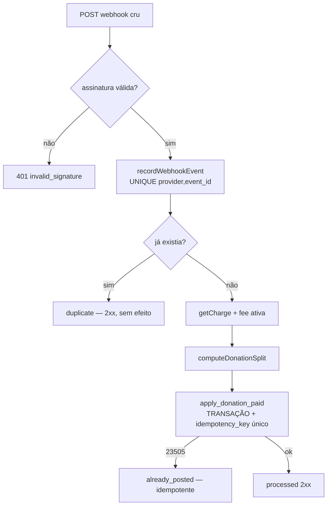

# 07 — Arquitetura de Pagamentos

> Nesta fase **não há pagamento real**. Tudo roda pelo `MockPaymentProvider`. O `WooviPaymentProvider`
> existe, mas fica **desativado** por feature flag. Nenhuma chamada de rede real de pagamento é feita.

## 1. Porta e adaptadores

A camada de pagamentos é uma **porta** (`PaymentProvider`) com dois **adaptadores**:

```
PaymentProvider (interface) — src/features/payments/provider.ts
├── MockPaymentProvider     — src/features/payments/mock-provider.ts   (dev, ativo)
└── WooviPaymentProvider    — src/features/payments/woovi-provider.ts  (desativado)
```

Interface (contrato):
```ts
createCharge(input): NormalizedCharge
getCharge(externalId): NormalizedCharge
expireCharge(externalId): NormalizedCharge
refundCharge(input): NormalizedRefund
verifyWebhook(rawBody, headers): { valid }
parseWebhook(rawBody, headers): ParsedWebhook   // eventId único p/ idempotência
reconcileCharge(externalId): NormalizedCharge    // reconciliação server-side
```

A fábrica `getPaymentProvider()` (`src/features/payments/index.ts`) retorna **sempre o Mock** enquanto
`PAYMENTS_ENABLED` e `WOOVI_ENABLED` forem `false` (ou `WOOVI_APP_ID` vazio).

Valores são **sempre em centavos**. `correlationId` = identificador interno idempotente (usamos o `donation.id`), nunca dado sensível.

## 2. MockPaymentProvider

- `createCharge`: gera `externalChargeId = mock_<correlationId>`, status `pending` e um BR Code placeholder determinístico (não é Pix real). **Não guarda CPF** no payload bruto.
- Webhook mock assinado com **HMAC-SHA256** (header `x-mock-signature`, segredo `MOCK_WEBHOOK_SECRET`), verificado com comparação *timing-safe*.
- `simulateMockPayment(donationId)` (server action, **só em dev**) monta um webhook mock assinado e o envia para a rota real `/api/webhooks/mock`, exercitando **o mesmo pipeline** de um provedor real.

## 3. WooviPaymentProvider (desativado)

Implementado fielmente aos contratos **documentados oficialmente** (ver `docs/09-woovi-readiness.md`), sem inventar endpoints:

| Operação | Endpoint documentado |
|---|---|
| Auth | header `Authorization: <AppID>` (AppID puro) |
| Criar cobrança | `POST /api/v1/charge` (value em centavos, `correlationID` idempotente) |
| Consultar | `GET /api/v1/charge/{id}` |
| Expirar | `DELETE /api/v1/charge/{id}` |
| Reembolsar | `POST /api/v1/charge/{id}/refund` |
| Webhook (assinatura) | HMAC-SHA1 base64 em `X-OpenPix-Signature` **ou** RSA-SHA256 em `x-webhook-signature` |

Requisitos atendidos no adapter: **só código de servidor**, credenciais de env, base URL sandbox/prod, **timeout** (AbortController), retry apenas em operações seguras (idempotentes), tratamento de erro de rede, normalização de resposta, **não vaza payload sensível em log**, correlation IDs internos, chamadas mockáveis nos testes. Enquanto desativado, qualquer chamada de rede lança `WooviDisabledError`.

**Recursos que dependem de habilitação comercial** (split, subcontas, saque/transfer, KYC/partner) **NÃO** são chamados: existem apenas como **contratos internos + campos no banco + feature flags + documentação + mocks** (ver seção 7). Não há chamadas fictícias a endpoints inexistentes.

## 4. Cálculo de taxas (versionado)

Fonte: tabela `platform_fees` (uma versão ativa). Nunca há número de taxa espalhado na UI.

Fórmulas (`src/features/payments/fees.ts`, testadas):
```
gateway_fee = round(gross * gateway_fee_bps / 10000) + gateway_fee_fixed_cents
platform_fee = round(gross * platform_fee_bps / 10000)
net          = gross - gateway_fee - platform_fee        (>= 0, senão erro)
```
**Invariante garantida e testada:** `gross === gateway_fee + platform_fee + net`.

Defaults atuais (placeholders — `docs/11`): platform 500 bps (5%), gateway 99 bps (0,99%), fixo 0, mínimo de contribuição R$5,00.

## 5. Ledger (fonte oficial)

Cada doação paga gera **um grupo de 4 lançamentos** (`src/features/ledger/postings.ts`), aplicados na função SQL transacional `apply_donation_paid`:

| Conta | Tipo | Valor |
|---|---|---|
| `gateway_clearing` | `donation_gross` | gross |
| `gateway_fee_expense` | `gateway_fee` | gateway_fee |
| `platform_revenue` | `platform_fee` | platform_fee |
| `campaign_pending`\|`campaign_available` | `campaign_credit` | net |

`campaign_available` se `release_delay_days == 0`, senão `campaign_pending` (com liberação posterior). Saldos derivam de `campaign_ledger_balance` / `my_campaign_balance` (RPC SECURITY DEFINER). O `campaigns.raised_amount_cents` é **cache**, atualizado a partir do ledger — nunca a fonte oficial.

Fórmulas de saldo:
```
raised_gross   = Σ donation_gross
platform_fee   = Σ platform_fee
gateway_fee    = Σ gateway_fee
pending        = Σ (direction * amount) em campaign_pending
available      = Σ (direction * amount) em campaign_available
withdrawn      = Σ (direction * amount) em campaign_withdrawn
refunded       = Σ (refund + chargeback)
refundable     = gross_pago - já_reembolsado
```

## 6. Pipeline de webhook (idempotente)

`src/features/webhooks/processor.ts` — lógica agnóstica de banco, testada com repo em memória; a implementação real é `SupabaseWebhookRepository`.



**Duas barreiras de idempotência:**
1. `UNIQUE (provider, event_id)` em `payment_webhook_events` — impede reprocessar o mesmo evento.
2. `UNIQUE idempotency_key` em `ledger_entries` — impede duplicar lançamentos **mesmo sob concorrência** (duas execuções simultâneas: a segunda recebe 23505 e é tratada como `already_posted`).

Regras invioláveis:
- O **frontend nunca marca uma doação como paga**. Só o webhook/reconciliação server-side muda para `paid`.
- A resposta ao gateway é **rápida**; o processamento é transacional.
- Payloads brutos ficam em `payment_webhook_events.raw_payload`, sem policy de leitura para cliente (só service role) e sem log em claro.

Prova end-to-end contra o banco real: `scripts/smoke-e2e.mjs` (4 lançamentos, saldo correto, duplicado bloqueado sem duplicar, ledger imutável, RLS bloqueando cliente).

## 7. Split, subcontas, KYC e saque (preparados, desativados)

Contratos internos e campos já existem, controlados por flags:

| Recurso | Flag | Estado no banco | Depende de habilitação comercial? |
|---|---|---|---|
| Split | `WOOVI_SPLIT_ENABLED` | modelado via ledger + futuro `splits` na charge | Sim (subconta e/ou suporte Woovi) |
| Subcontas | `WOOVI_SUBACCOUNTS_ENABLED` | contas do ledger; futura `POST /api/v1/subaccount` | Sim |
| KYC | `KYC_ENABLED` | `organizer_kyc` (status/provider/external_id) | Sim |
| Saque | `WITHDRAWALS_ENABLED` | `withdrawal_requests`, `payouts` | Sim (payout Woovi exige liberação) |

Nenhum desses caminhos faz chamada real nesta fase. Ver `docs/09-woovi-readiness.md` e `docs/11-open-decisions.md`.

## 8. Feature flags mínimas
```
PAYMENTS_ENABLED=false
WOOVI_ENABLED=false
WOOVI_SPLIT_ENABLED=false
WOOVI_SUBACCOUNTS_ENABLED=false
WITHDRAWALS_ENABLED=false
KYC_ENABLED=false
```
Além das de produto (futuras, no banco): `HEARTS_ENABLED`, `EMOJIS_ENABLED`, `HIGHLIGHT_ENABLED`, `PLATFORM_SEED_DONATION_ENABLED`.
